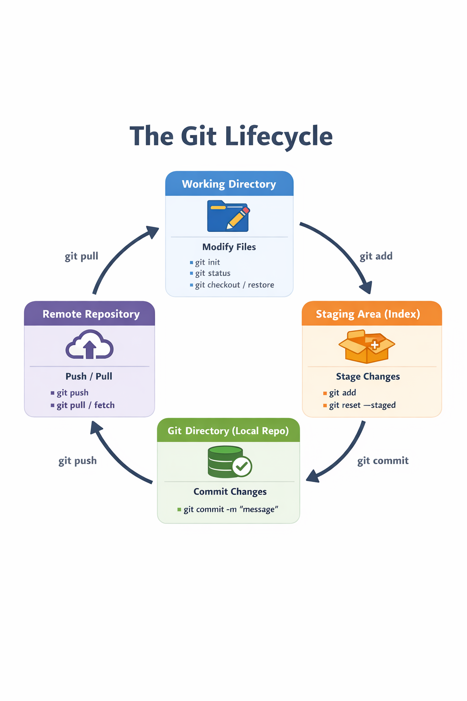

        ######### GIT Commands  ##############
# Most widely used git commands in day to day activities of DevOps Engineer
# Git Lifecycle

# Git Branch Management
🌳 Git Branching Strategy (Practical + Best Practices)

## 🌿 Branch & Merge Commands

| Command                     | Description                                                              |
|-----------------------------|--------------------------------------------------------------------------|
| `git branch`               | Lists all local branches. The currently active branch is marked with `*`. |
| `git branch <branch-name>`  | Creates a new branch from the current commit.                            |
| `git checkout <branch-name>`| Switches to the specified branch and updates the working directory.      |
| `git merge <branch-name>`   | Merges the specified branch’s history into the current branch.           |
| `git log`                   | Displays the commit history of the current branch.                       |

## 🔹 Basics

- git init → Initialize a new repository
- git clone <repo-url> → Clone an existing repository
- git status → Show working tree status
- git add <file> / git add . → Stage changes
- git commit -m "message" → Commit staged changes

## 🌿 Branch & Merge

- git branch → List branches
- git branch <name> → Create a new branch
- git switch <branch> / git checkout <branch> → Switch branches
- git merge <branch> → Merge branch into current branch
- git log --oneline --graph → View commit history

## 🔄 Undo Changes 

- git restore <file> → Discard local changes in file
- git restore --staged <file> → Unstage file without losing changes
- git reset --hard HEAD → Discard all local changes (dangerous)

## 📦 Stash Changes

- git stash → Save uncommitted changes temporarily
- git stash list → View stashed changes
- git stash pop → Apply and remove latest stash

## 🕒 Rewriting History

- git commit --amend → Modify last commit
- git rebase <branch> → Reapply commits on top of another branch
- git revert <commit> → Safely undo a commit (recommended in teams)

## 🌐 Remote Repository

- git remote -v → View remotes
- git fetch → Download changes without merging
- git pull → Fetch + merge changes

## 🛠️ Git Troubleshooting Commands

## 🔄 Push / Pull Issues
❌ Rejected – non-fast-forward
 - git pull --rebase

# 👉 Rebase local commits on top of remote

- git push --force-with-lease
# 👉 Safe force push (preferred over --force)

# ❌ Your branch is behind
- git fetch origin
- git status

# 👉 Check remote changes before merging

##⚠️ Merge Conflicts
# 🔍 Identify Conflicted Files
- git status

# 🧩 Open Conflict Markers
- git diff

✅ After Resolving Conflicts
- git add <file>
- git commit

❌ Abort a Merge
- git merge --abort

❌ Abort a Rebase
- git rebase --abort

## 🔄 Undo & Recovery
❌ Undo Last Commit (Keep Changes)
- git reset --soft HEAD~1

❌ Undo Last Commit (Discard Changes – Dangerous)
- git reset --hard HEAD~1

🧯 Recover Deleted Commits
- git reflog
- git reset --hard <commit-id>

## 📦 Stash Issues
❌ Accidentally Stashed Changes
- git stash list
- git stash apply stash@{0}

❌ Remove All Stashes
- git stash clear

🌐 Remote Repository Issues
❌ Wrong Remote URL
- git remote set-url origin <new-url>

❌ Remove and Re-add Remote
- git remote remove origin
- git remote add origin <repo-url>
